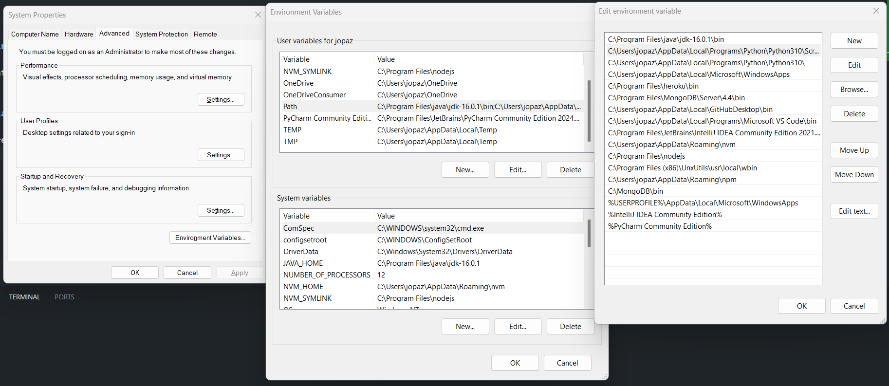

# reserva-tu-campo

## instalar python 3.10
https://www.python.org/downloads/release/python-3100/

## crear virtual environment
```
python -m venv venv
```

## activate venv - Windows (Command Prompt)
```
.\venv\Scripts\activate.bat
```

## instala dependencias
```
pip install -r requirements.txt
```

## database setup
https://learn.microsoft.com/en-us/samples/azure-samples/mssql-django-samples/mssql-django-samples/

## Como crear un django project
https://docs.djangoproject.com/en/5.0/intro/tutorial01/
```
django-admin startproject reservatucampo
```

## Como correr el servidor
```
python manage.py runserver
```

## instalar Microsoft SQL Server y SSMS
[version Express](https://www.microsoft.com/en-us/sql-server/sql-server-downloads)
[SSMS](https://learn.microsoft.com/en-us/sql/ssms/download-sql-server-management-studio-ssms?view=sql-server-ver16&redirectedfrom=MSDN#download-ssms)

## crear archivo .env con los siguientes valores
DEBUG=
DB_NAME=
DB_USER=
DB_PASSWORD=
DB_HOST=
DB_PORT=